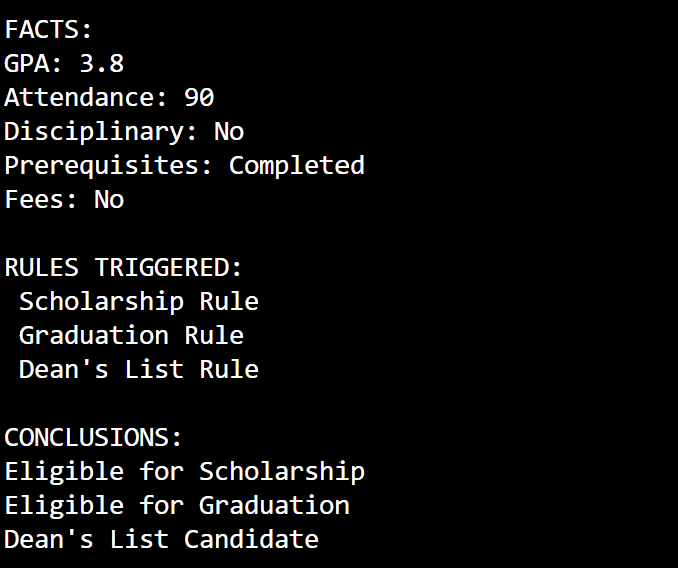
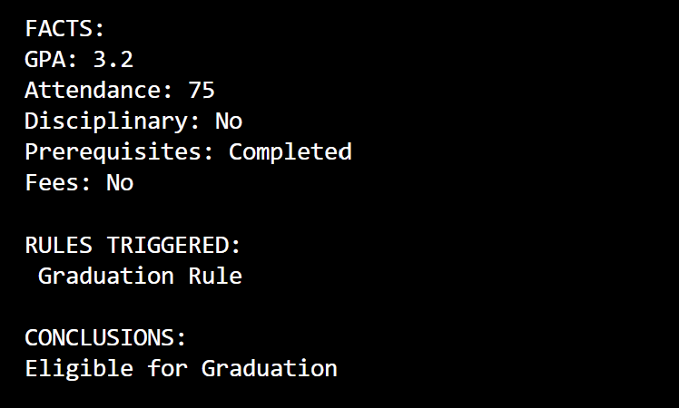
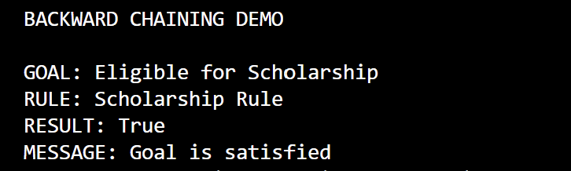
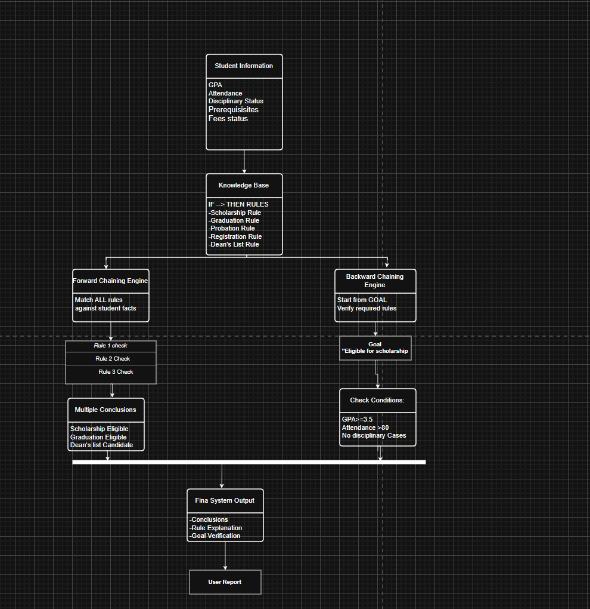

# Student Academic Advisor: Rule-Based Reasoning and Inference Engine

## Introduction

This project implements a rule-based expert system that acts as an academic advisor for university students. The system evaluates student records using a knowledge base of academic policies and generates recommendations based on predefined rules.

The project demonstrates the use of Artificial Intelligence reasoning techniques, specifically Forward Chaining and Backward Chaining inference.

---

## Problem Statement

Universities must evaluate students for various academic outcomes such as scholarship eligibility, graduation eligibility, academic probation, and registration status.

Manual evaluation of these conditions can be time-consuming and inconsistent. This project automates the decision-making process by applying a set of predefined academic rules to student information.

---

## Knowledge Base

The system uses a JSON-based knowledge base containing facts and rules.

### Student Facts

The following attributes are considered:

* GPA
* Attendance
* Disciplinary Status
* Prerequisite Completion Status
* Fee Status

### Knowledge Representation Example

```json
{
  "name": "Scholarship Rule",
  "if": {
    "gpa": ">=3.5",
    "attendance": ">80",
    "disciplinary": "No"
  },
  "then": "Eligible for Scholarship"
}
```

---

## Rules Implemented

### Scholarship Rule

IF:

* GPA ≥ 3.5
* Attendance > 80%
* No disciplinary cases

THEN:

* Eligible for Scholarship

### Graduation Rule

IF:

* GPA > 3.0
* Completed prerequisite courses
* No outstanding fees

THEN:

* Eligible for Graduation

### Probation Rule

IF:

* GPA < 3.0

THEN:

* Academic Probation

### Registration Rule

IF:

* Outstanding fees exist

THEN:

* Registration Blocked

### Dean's List Rule

IF:

* GPA ≥ 3.5
* Attendance > 80%

THEN:

* Dean's List Candidate

---

## Reasoning Methods Used

### Forward Chaining

Forward Chaining is a data-driven reasoning method. The system starts with known student facts and evaluates all rules in the knowledge base. Any rule whose conditions are satisfied generates a conclusion.

Example:

Facts → Rules → Conclusions

### Backward Chaining

Backward Chaining is a goal-driven reasoning method. The system starts with a desired goal and checks whether the student's facts satisfy the conditions required to achieve that goal.

Example:

Goal → Rule Conditions → Facts Verification

---


### Forward Chaining Output





### Backward Chaining Output



### Inference Flow Diagram



---


## Sample Input

```text
GPA = 3.8
Attendance = 90
Disciplinary Status = No
Prerequisites = Completed
Fees = No
```

---

## Sample Output

### Forward Chaining

```text
Rule Applied : Scholarship Rule
Conclusion   : Eligible for Scholarship

Rule Applied : Graduation Rule
Conclusion   : Eligible for Graduation

Rule Applied : Dean's List Rule
Conclusion   : Dean's List Candidate
```

### Backward Chaining

```text
Goal      : Eligible for Scholarship
Result    : True
Rule      : Scholarship Rule
Message   : Goal is satisfied
```

---


## Author

Developed as part of a Knowledge-Based Systems / Artificial Intelligence laboratory assignment on Reasoning and Inferencing Systems.
